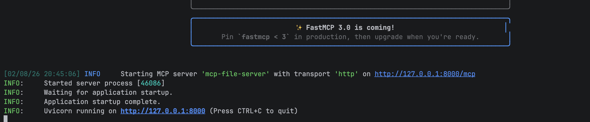

# mcp-file-metadata-server
MCP server that exposes tools to provide file content and information to LLMs like Claude.

## Running your MCP server
Run your *main.py* python file. You should see output below in your terminal.

